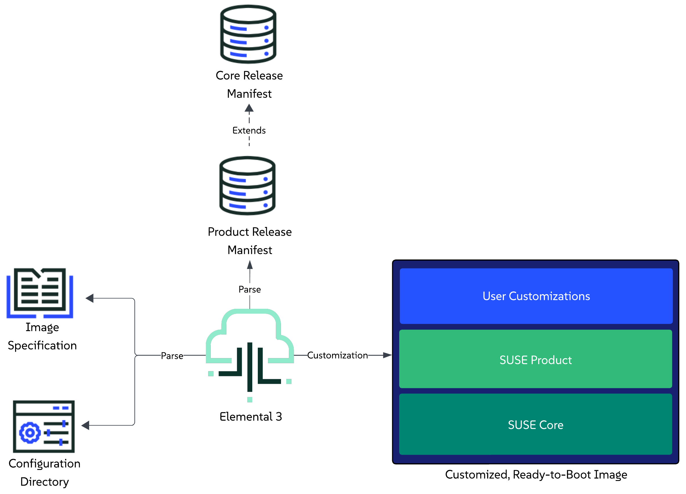

# Image Customization

This section provides an overview of how the `elemental3` command-line interface enables users to customize and extend an image that is based on a specific set of components defined in a [release manifest](release-manifest.md).

For general information about the customization process, refer to the [Customization Process](#customization-process) section.

For information on how to boot a customized image, refer to the [Booting a customized image](#booting-a-customized-image) section.

For real-life examples, refer to the [Examples](#examples) section.

## Customization Process

The customization process is executed through the `elemental3 customize` command.

As part of the command, users are expected to provide:

1. **Specifications for the image** - these are defined as options to the command itself. Available specification options can be viewed by calling the command's help message: `elemental3 customize -h`.
2. **Information about the desired state of the image** - this is done through the definition of a configuration directory that the user creates beforehand. For more information on the directory itself, refer to the [Configuration Directory Guide](configuration-directory.md).

We recommend you familiarize yourself with both points before attempting to customize your first image. 

For further understanding of the customization process, you can also refer to the following sections:

- [Limitations](#limitations) - for any limitations that the process might have.
- [Overview](#overview) - for a high-level description of the steps that the customization process goes through.
- [Execution](#execution) - for supported methods to trigger the customization process.

### Limitations

Currently, the image customization process has the following limitations:

1. Supports customizing images only for `x86_64` platforms.
1. Supports customizing images for connected (non air-gapped) environments only.

Elemental is in active development, and these limitations **will** be addressed as part of the product roadmap.

### Overview

> **NOTE**: The user is able to customize Linux-only images by **excluding** Kubernetes resources and deployments from the configuration directory (regardless of whether this is under `kubernetes/manifests`, `kubernetes.yaml` or `release.yaml`). This is currently an implicit process, but it is possible that an explicit option for it (e.g. a flag) is added at a later stage.

This section provides a high-level overview of the steps that Elemental's tooling goes through in order to produce a customized and extended image.

*Steps:*
1. Parse the user provided image specifications.
1. Parse the configuration directory that the user has defined in the image specification.
1. Parse the [product release manifest](release-manifest.md#product-release-manifest) that the user has defined as a [release reference](configuration-directory.md#product-release-reference) in the `release.yaml` file of the configuration directory.
1. Pull and parse the [core platform release manifest](release-manifest.md#core-platform-release-manifest) that the aforementioned product manifest extends.
1. Begin the customization process:
   1. Unpack the pre-built installer ISO that is defined in the `core platform` release manifest.
   1. Prepare for Kubernetes cluster creation and resource deployment:
      1. Prepare Helm charts and Kubernetes manifests
      1. Download the RKE2 extension image, as specified in the parsed `core platform` release manifest.
   1. Prepare any other overlays or firstboot configurations based on what was defined in the configuration directory.
   1. Produce a description of the desired installation state and merge it with the installer ISO description.
   1. Produce the final desired image type.
1. Mark customization as completed.



### Execution

Starting the customization process can be done either by directly working with the `elemental3` binary, or by using the `elemental3` container image. Below you can find the minimum set of options for running both use cases.

#### Binary

```shell
sudo elemental3 customize --type <raw/iso> --config-dir <path>
```

Unless configured otherwise, after execution, the process will create a directory called `_customize` which will contain the ready to boot image.

> **IMPORTANT:** The above process is long running, as it involves pulling multiple component images over the network.
> For a quicker execution, use locally pulled container images in combination with the `--local` flag.

> **NOTE:** If you have specified either the `--customize-output` or `--output` options, your customize directory and/or image name will be different.

#### Container image

> **IMPORTANT:** Access to SUSE's internal VPN is required. As of this moment, our component images are not publicly available. This will change in the future.

> **NOTE:** This section assumes you have pulled the `elemental3` container image and referenced it in the `ELEMENTAL_IMAGE` variable. 

Run the customization process:

* For a RAW disk image:
   ```shell
   podman run -it -v <PATH_TO_CONFIG_DIR>:/config-dir $ELEMENTAL_IMAGE customize --type raw --config-dir /config-dir --output /config-dir/customized.raw
   ```

* For ISO media:
   ```shell
   podman run -it -v <PATH_TO_CONFIG_DIR>:/config-dir $ELEMENTAL_IMAGE customize --type iso --config-dir /config-dir --output /config-dir/customized.iso
   ```

> **IMPORTANT:** The above process is long running, as it involves pulling multiple component images over the network.
> For a quicker execution, use locally pulled container images in combination with mounting the podman socket to the `elemental3` container image and specifying the `--local` flag:
>
> 1. Start Podman socket:
>   ```shell
>   systemctl enable --now podman.socket
>   ```
> 2. Run the `elemental3` container with the mounted podman socket:
>   ```shell
>   podman run -it -v <PATH_TO_CONFIG_DIR>:/config-dir -v /run/podman/podman.sock:/var/run/docker.sock $ELEMENTAL_IMAGE customize --type <raw/iso> --config-dir /config-dir --output /config-dir/customized.<raw/iso> --local
>   ```

Unless configured otherwise, the above process will produce a customized RAW or ISO image under the specified `<PATH_TO_CONFIG_DIR>` directory.

## Booting a customized image

> **NOTE:** The below RAM and vCPU resources are just reference values, feel free to tweak them based on what your environment needs.

The customized image can be booted as any other regular image. Below you can find an example of how this can be done by using Libvirt to setup a virtual machine from a customized image that has a static network configured for machines with the `FE:C4:05:42:8B:AB` MAC address.

* RAW disk image:

   ```shell
   virt-install --name customized-raw \
               --ram 16000 \
               --vcpus 10 \
               --disk path="customized.raw",format=raw \
               --osinfo detect=on,name=sle-unknown \
               --graphics none \
               --console pty,target_type=serial \
               --network network=default,model=virtio,mac=FE:C4:05:42:8B:AB \
               --virt-type kvm \
               --import \
               --boot uefi,loader=/usr/share/qemu/ovmf-x86_64-ms-code.bin,nvram.template=/usr/share/qemu/ovmf-x86_64-ms-vars.bin
   ```

* ISO media:

   * Create an empty `disk.img` disk image that will be used as a storage device:
     
     ```shell
     truncate -s 20G disk.img
     ```

   * Create a local copy of the EFI variable store:
     
     > **NOTE:** This is needed in order to persist any new EFI entries included during the ISO installer boot.
     ```shell
     cp /usr/share/qemu/ovmf-x86_64-vars.bin .
     ```

   * Boot a VM using the previously created resources, namely the `customized.iso`, `disk.img` and local EFI store:
   
      ```shell
      virt-install --name customized-iso \
                  --ram 16000 \
                  --vcpus 10 \
                  --import \
                  --disk path=disk.img,format=raw \
                  --cdrom "customized.iso" \
                  --boot loader=/usr/share/qemu/ovmf-x86_64-code.bin,loader.readonly=yes,loader.type=pflash,nvram=ovmf-x86_64-vars.bin \
                  --graphics none \
                  --console pty,target_type=serial \
                  --network network=default,model=virtio,mac=FE:C4:05:42:8B:AB \
                  --osinfo detect=on,name=sle-unknown \
                  --virt-type kvm
      ```

## Examples

This section aims at providing real-life examples of the image customization process, as described in the "[Customization Process](#customization-process)" section.

> **IMPORTANT:** Before proceeding with the examples below, make sure you have familiarized yourself with the necessary [prerequisites](#prerequisites).

The examples will showcase how you can use the `elemental3` container image to achieve the following customization use cases:

- [Linux only image](#linux-only-image)
- [Single-node Kubernetes cluster](#single-node-kubernetes-cluster)
- [Multi-node Kubernetes cluster](#multi-node-kubernetes-cluster)

### Prerequisites

* Access to SUSE's internal VPN (as of this moment, our component images are not publicly available).
* A server or virtual machine running Tumbleweed, Leap 16.0, Leap Micro 6.2, SLES 16 or SUSE Linux Micro 6.2, with a minimum x86_64-v2 instruction set.
* Some other packages can also be needed if you want to compile the binaries yourself: `git-core go make mtools squashfs xorriso`.

### Linux only image

#### Use case

A user wants to customize and produce a RAW image that is based on a specific `Core Platform` version.

Additionally, the user wants to configure the image’s network and extend the environment with a custom systemd service tailored to their specific use case.

#### Configuration directory setup

The user creates a [configuration directory](../examples/elemental/customize/linux-only/) that describes the desired configurations that needs to be applied over the desired `Core Platform` release.

The contents of this directory include:

* [install.yaml](../examples/elemental/customize/linux-only/install.yaml) - specifies which `bootloader` and `kernel command line` arguments to use during the OS installation process and define the actual `disk size` of the image.
* [butane.yaml](../examples/elemental/customize/linux-only/butane.yaml) - specifies a [butane](https://coreos.github.io/butane/) configuration that describes the user that will be used for to login, as well as the custom systemd service that is required by the example use case.
* [release.yaml](../examples/elemental/customize/linux-only/release.yaml) - specifies the desired `Core Platform` release that will be customized and extended.
* [example-libvirt.yaml](../examples/elemental/customize/linux-only/network/example-libvirt.yaml) - specifies custom network configuration that ensures that a machine with a given MAC will be assigned a statically defined IP address.

#### Producing the customized image

1. Navigate to your configuration directory:
   
   ```shell
   cd examples/elemental/customize/linux-only/
   ```

1. Following the steps for executing the customization process through a [container image](#container-image) using locally pulled images, run the process for the desired RAW type:
   > **NOTE:** This command assumes that the Podman socket was started and the `$ELEMENTAL_IMAGE` points to a valid `elemental3` container image.

   ```shell
   podman run -it -v .:/config-dir -v /run/podman/podman.sock:/var/run/docker.sock $ELEMENTAL_IMAGE customize --type raw --config-dir /config-dir --output /config-dir/customized.raw --local
   ```
   
After execution, for a RAW disk type, your `examples/elemental/customize/linux-only` directory should look similar to:

```text
.
├── butane.yaml
├── customized.raw <- created by the customization process
├── customized.raw.sha256 <- created by the customization process
├── install.yaml
├── network/
└── release.yaml
```

#### Booting the image

Following what is described in the "[Booting a customized image](#booting-a-customized-image)" section, we boot a virtual machine using Libvirt: 

```shell
virt-install --name linux-only-example \
             --ram 16000 \
             --vcpus 10 \
             --disk path="customized.raw",format=raw \
             --osinfo detect=on,name=sle-unknown \
             --graphics none \
             --console pty,target_type=serial \
             --network network=default,model=virtio,mac=FE:C4:05:42:8B:AB \
             --virt-type kvm \
             --import \
             --boot uefi,loader=/usr/share/qemu/ovmf-x86_64-ms-code.bin,nvram.template=/usr/share/qemu/ovmf-x86_64-ms-vars.bin
```

> **NOTE:** Based on the `FE:C4:05:42:8B:AB` MAC address, during first boot this will apply the network configuration defined in the [network/example-libvirt.yaml](../examples/elemental/customize/linux-only/network/example-libvirt.yaml) file on the machine.

#### Environment overview

Once the machine has successfully been booted with the customized image, you can verify the environment going through the following set of steps:

1. Verify that the expected operating system is running:

   ```shell
   cat /etc/os-release
   ```

1. Verify the custom network configuration has been applied:

   ```shell
   ip a
   ```

1. Verify the machine's hostname:

   > **NOTE:** If you have defined a MAC address that matches one of the network configuration files defined under the [network/](../examples/elemental/customize/linux-only/network/) directory, the hostname will be set to the name of that file.

   ```shell
   cat /etc/hostname
   ```

1. Verify the disk size of the machine:

   ```shell
   df -Th
   ```

1. Verify that the custom systemd service has been executed:

   ```shell
   journalctl -u example.service
   ```

### Single-node Kubernetes cluster

#### Use case

A consumer has created a release manifest for their product that extends a specific `Core Platform` version with additional components, namely `Rancher` and `cert-manager`.

A user wants to customize and produce a RAW image that will be running an operating system, Kubernetes distribution and Rancher version that are supported by the aforementioned consumer product.

Furthermore, using this image, the user wants to setup a single-node Kubernetes cluster that will be extended with the `NeuVector` Helm chart along with a specific set of Kubernetes manifests that will enable access to the Rancher UI.

#### Configuration directory setup

The user creates a [configuration directory](../examples/elemental/customize/single-node/) that describes the desired configurations that needs to be applied over the desired `Product` release.

The contents of this directory include:

* [install.yaml](../examples/elemental/customize/single-node/install.yaml) - specifies which `bootloader` and `kernel command line` arguments to use during the OS installation process and define the actual `disk size` of the image.
* [butane.yaml](../examples/elemental/customize/single-node/butane.yaml) - specifies a [butane](https://coreos.github.io/butane/) configuration that defines the user that will be used to log into the booted system.
* [kubernetes.yaml](../examples/elemental/customize/single-node/kubernetes.yaml) - specifies the user-desired `NeuVector` Helm chart as well as a remote manifest for the [local-path-provisioner](https://github.com/rancher/local-path-provisioner).
* [release.yaml](../examples/elemental/customize/single-node/release.yaml) - specifies the reference to the desired product. From this product release, enable the desired Kubernetes distribution, as well as `Rancher` and `MetalLB`.
* [suse-product-manifest.yaml](../examples/elemental/customize/single-node/suse-product-manifest.yaml) - example for a `Product` release manifest that the user has referred in the `release.yaml` configuration file.
* [rancher.yaml](../examples/elemental/customize/single-node/kubernetes/helm/values/rancher.yaml) - custom values for the `Rancher` Helm chart that the user has enabled from the `Product` release manifest.
* [ip-pool.yaml](../examples/elemental/customize/single-node/kubernetes/manifests/ip-pool.yaml) - local manifest to apply to the cluster and have the enabled `MetalLB` component setup an `IPAddressPool`.
* [l2-adv.yaml](../examples/elemental/customize/single-node/kubernetes/manifests/l2-adv.yaml) - local manifest to apply to the cluster and have the enabled `MetalLB` component setup a `L2Advertisement`.
* [rke2-ingress-config.yaml](../examples/elemental/customize/single-node/kubernetes/manifests/rke2-ingress-config.yaml) - local manifest that will edit the existing `rke2-ingress-nginx` Helm chart and will enable its service to be of type `LoadBalancer`.
* [single-node-example.yaml](../examples/elemental/customize/single-node/network/single-node-example.yaml) - custom network configuration that sets up a static IP for machines with the `FE:C4:05:42:8B:AB` MAC address.

#### Producing the customized image

1. Navigate to your configuration directory:
   
   ```shell
   cd examples/elemental/customize/single-node/
   ```

1. Following the steps for executing the customization process through a [container image](#container-image) using locally pulled images, run the process for the desired RAW type:
   > **NOTE:** This command assumes that the Podman socket was started and the `$ELEMENTAL_IMAGE` points to a valid `elemental3` container image.

   ```shell
   podman run -it -v .:/config-dir -v /run/podman/podman.sock:/var/run/docker.sock $ELEMENTAL_IMAGE customize --type raw --config-dir /config-dir --output /config-dir/customized.raw --local
   ```
   
After execution, for a RAW disk type, your `examples/elemental/customize/single-node/` directory should look similar to:

```text
.
├── butane.yaml
├── customized.raw <- created by the customization process
├── customized.raw.sha256 <- created by the customization process
├── install.yaml
├── kubernetes/
├── kubernetes.yaml
├── network/
├── release.yaml
└── suse-product-manifest.yaml
```

#### Booting the image

Following what is described in the [Booting a customized image](#booting-a-customized-image) section, we boot a virtual machine using Libvirt: 

```shell
virt-install --name single-node-example \
             --ram 16000 \
             --vcpus 10 \
             --disk path="customized.raw",format=raw \
             --osinfo detect=on,name=sle-unknown \
             --graphics none \
             --console pty,target_type=serial \
             --network network=default,model=virtio,mac=FE:C4:05:42:8B:AB \
             --virt-type kvm \
             --import \
             --boot uefi,loader=/usr/share/qemu/ovmf-x86_64-ms-code.bin,nvram.template=/usr/share/qemu/ovmf-x86_64-ms-vars.bin
```

> **NOTE:** Based on the `FE:C4:05:42:8B:AB` MAC address, during first boot this will apply the network configuration defined in the [network/single-node-example.yaml](../examples/elemental/customize/single-node/network/single-node-example.yaml) file on the machine.

#### Environment overview

Once the machine has successfully been booted with the customized image, you can verify the environment going through the following set of steps:

1. Verify that the expected operating system is running:

   ```shell
   cat /etc/os-release
   ```

1. Verify the custom network configuration has been applied:

   ```shell
   ip a
   ```

1. Verify the machine's hostname:

   ```shell
   cat /etc/hostname
   ```

1. Setup `kubectl`:

   ```shell
   alias kubectl='KUBECONFIG=/etc/rancher/rke2/rke2.yaml /var/lib/rancher/rke2/bin/kubectl'
   ```

1. Verify cluster node:

   ```shell
   kubectl get nodes -o wide

   # Example output
   NAME                  STATUS   ROLES                AGE     VERSION          INTERNAL-IP       EXTERNAL-IP   OS-IMAGE                            KERNEL-VERSION            CONTAINER-RUNTIME
   single-node-example   Ready    control-plane,etcd   3m18s   v1.34.2+rke2r1   192.168.122.251   <none>        SUSE Linux Enterprise Server 16.0   6.12.0-160000.6-default   containerd://2.1.5-k3s1
   ```

1. Verify that the Core Platform enabled `MetalLB` component is running:

   ```shell
   kubectl get pods -n metallb-system

   # Example output
   NAME                                  READY   STATUS    RESTARTS   AGE
   metallb-controller-6b59fb78f4-fk6wq   1/1     Running   0          13m
   metallb-speaker-w9gtc                 4/4     Running   0          13m
   ```

1. Verify product enabled Helm chart components:

   * *NeuVector*:

      ```shell
      kubectl get pods -n neuvector-system

      # Example output
      NAME                                        READY   STATUS      RESTARTS   AGE
      neuvector-cert-upgrader-job-ntj2d           0/1     Completed   0          9m4s
      neuvector-controller-pod-79bb56d6c4-dmxmx   1/1     Running     0          11m
      neuvector-controller-pod-79bb56d6c4-lq2p8   1/1     Running     0          11m
      neuvector-controller-pod-79bb56d6c4-xjrk2   1/1     Running     0          11m
      neuvector-enforcer-pod-wmlqx                1/1     Running     0          11m
      neuvector-manager-pod-987b84867-4k88j       1/1     Running     0          11m
      neuvector-scanner-pod-d8bf5677d-6k6tf       1/1     Running     0          11m
      neuvector-scanner-pod-d8bf5677d-hnxfk       1/1     Running     0          11m
      neuvector-scanner-pod-d8bf5677d-s67zh       1/1     Running     0          11m
      ```
   * *Rancher*:

      ```shell
      kubectl get pods -n cattle-system

      # Example output
      NAME                                        READY   STATUS      RESTARTS   AGE
      rancher-66b9664747-j2sfp                    1/1     Running     0          36m
      rancher-webhook-7748c7b4bf-42xg4            1/1     Running     0          22m
      system-upgrade-controller-67f899b56-rzcqh   1/1     Running     0          21m
      ```

1. Verify that the custom `Rancher` Helm chart values defined under `kubernetes/helm/values/rancher.yaml` have been propagated to the `rancher` HelmChart resource:

   ```shell
   kubectl get helmchart rancher -n kube-system -o jsonpath='{.spec.valuesContent}'

   # Example output
   bootstrapPassword: admin1234
   hostname: 192.168.76.15.sslip.io
   replicas: 1
   ```

1. Verify that the manifests from the `kubernetes/manifests` directory have been applied:

   * MetalLB `IPAddressPool` resource:

      ```shell
      kubectl get ipaddresspools -A

      # Example output
      NAMESPACE        NAME             AUTO ASSIGN   AVOID BUGGY IPS   ADDRESSES
      metallb-system   ingress-ippool   true          false             ["192.168.76.15/32"]
      ```

   * MetalLB `L2Advertisement` resource:

      ```shell
      kubectl get l2advertisements -A

      # Example output
      NAMESPACE        NAME             IPADDRESSPOOLS       IPADDRESSPOOL SELECTORS   INTERFACES
      metallb-system   ingress-l2-adv   ["ingress-ippool"]
      ```

   * RKE2 NGINX Ingress controller service is available, of type `LoadBalancer` and running on the `192.168.76.15` IP:

      ```shell
      kubectl get svc rke2-ingress-nginx-controller -n kube-system

      # Example output
      NAME                            TYPE           CLUSTER-IP     EXTERNAL-IP     PORT(S)                      AGE
      rke2-ingress-nginx-controller   LoadBalancer   10.43.117.57   192.168.76.15   80:30594/TCP,443:32133/TCP   42m
      ```

### Multi-node Kubernetes cluster

#### Use case

A consumer has created a release manifest for their product that extends a specific `Core Platform` version with additional components, namely `Rancher` and `cert-manager`.

A user wants to customize and produce a RAW image that will be running an operating system, Kubernetes distribution and Rancher version that are supported by the aforementioned consumer product.

Furthermore, using this image, the user wants to setup a multi-node Kubernetes cluster that will be extended with the `NeuVector` Helm chart along with a specific set of Kubernetes manifests that will enable access to the Rancher UI.

#### Configuration directory setup

The user creates a [configuration directory](../examples/elemental/customize/multi-node/) that describes the desired configurations that needs to be applied over the desired `Product` release.

The contents of the directory are the same as the contents for a [singel-node Kubernetes setup](#configuration-directory-setup-1), with the following additions:

- [network/](../examples/elemental/customize/multi-node/network/) - add network configuration for each desired node. This example configures the static IPs `192.168.122.250`, `192.168.122.251`, `192.168.122.252` and `192.168.122.253` for machines with the respective `FE:C4:05:42:8B:AB`, `FE:C4:05:42:8B:AC`, `FE:C4:05:42:8B:AD` and `FE:C4:05:42:8B:AE` MAC addresses.
- [kubernetes/config/agent.yaml](../examples/elemental/customize/multi-node/kubernetes/config/agent.yaml) - add configuration for the agent node.
- [kubernetes.yaml](../examples/elemental/customize/multi-node/kubernetes.yaml) - add multi-node cluster configuration that specifies the node's roles as well as the cluster's network setup.

#### Producing the customized image

1. Navigate to your configuration directory:
   
   ```shell
   cd examples/elemental/customize/multi-node/
   ```

1. Following the steps for executing the customization process through a [container image](#container-image) using locally pulled images, run the process for the desired RAW type:
   > **NOTE:** This command assumes that the Podman socket was started and the `$ELEMENTAL_IMAGE` points to a valid `elemental3` container image.

   ```shell
   podman run -it -v .:/config-dir -v /run/podman/podman.sock:/var/run/docker.sock $ELEMENTAL_IMAGE customize --type raw --config-dir /config-dir --output /config-dir/customized.raw --local
   ```
   
After execution, for a RAW disk type, your `examples/elemental/customize/single-node/` directory should look similar to:

```text
.
├── butane.yaml
├── customized.raw <- created by the customization process
├── customized.raw.sha256 <- created by the customization process
├── install.yaml
├── kubernetes/
├── kubernetes.yaml
├── network/
├── release.yaml
└── suse-product-manifest.yaml
```

#### Booting the image

> **NOTE:** This section assumes that each node will be booted using a copy of the produced `customized.raw` image as disk.

Following what is described in the "[Booting a customized image](#booting-a-customized-image)" section, for each desired node, we boot a virtual machine using the following template: 

```shell
virt-install --name <machine-name> \
             --ram 16000 \
             --vcpus 10 \
             --disk path="<copy-of-customized-raw>",format=raw \
             --osinfo detect=on,name=sle-unknown \
             --graphics none \
             --console pty,target_type=serial \
             --network network=default,model=virtio,mac=<node-MAC> \
             --virt-type kvm \
             --import \
             --boot uefi,loader=/usr/share/qemu/ovmf-x86_64-ms-code.bin,nvram.template=/usr/share/qemu/ovmf-x86_64-ms-vars.bin
```

Where:

- `<machine-name>` is the name of the machine as seen by `virsh list`.
- `<copy-of-customized-raw>` is a copy of the produced `customized.raw` disk that will be specific for this machine.
- `<node-MAC>` is the MAC address for the desired node, as defined in both [kubernetes.yaml](../examples/elemental/customize/multi-node/kubernetes.yaml) and [network/](../examples/elemental/customize/multi-node/network/).

#### Environment overview

Much of the environment validation is the same as for the [single-node Kubernetes cluster](#environment-overview-1) environment with following validation additions:

1. Validate [endpoint-copier-operator](https://github.com/suse-edge/endpoint-copier-operator) is deployed:
   
   ```shell
   kubectl get pods -n endpoint-copier-operator
   
   # Example output
   NAME                                        READY   STATUS    RESTARTS      AGE
   endpoint-copier-operator-695f9b84f6-lcvmw   1/1     Running   1 (17m ago)   19m
   endpoint-copier-operator-695f9b84f6-z5sk7   1/1     Running   0             19m
   ```

1. Validate `kubernetes-vip` service is created and running the IP specified in the [kubernetes.yaml](../examples/elemental/customize/multi-node/kubernetes.yaml) file:
   
   ```shell
   kubectl get svc kubernetes-vip

   # Example output
   NAME             TYPE           CLUSTER-IP    EXTERNAL-IP       PORT(S)                         AGE
   kubernetes-vip   LoadBalancer   10.43.7.188   192.168.122.100   9345:30094/TCP,6443:30921/TCP   20m
   ```

1. Validate that nodes have connected in a cluster successfully:

   ```shell
   kubectl get nodes -o wide

   # Example output
   NAME            STATUS   ROLES                AGE     VERSION          INTERNAL-IP       EXTERNAL-IP   OS-IMAGE                            KERNEL-VERSION            CONTAINER-RUNTIME
   node1.example   Ready    control-plane,etcd   26m     v1.34.2+rke2r1   192.168.122.250   <none>        SUSE Linux Enterprise Server 16.0   6.12.0-160000.6-default   containerd://2.1.5-k3s1
   node2.example   Ready    control-plane,etcd   13m     v1.34.2+rke2r1   192.168.122.251   <none>        SUSE Linux Enterprise Server 16.0   6.12.0-160000.6-default   containerd://2.1.5-k3s1
   node3.example   Ready    control-plane,etcd   13m     v1.34.2+rke2r1   192.168.122.252   <none>        SUSE Linux Enterprise Server 16.0   6.12.0-160000.6-default   containerd://2.1.5-k3s1
   node4.example   Ready    <none>               8m16s   v1.34.2+rke2r1   192.168.122.253   <none>        SUSE Linux Enterprise Server 16.0   6.12.0-160000.6-default   containerd://2.1.5-k3s1
   ```
